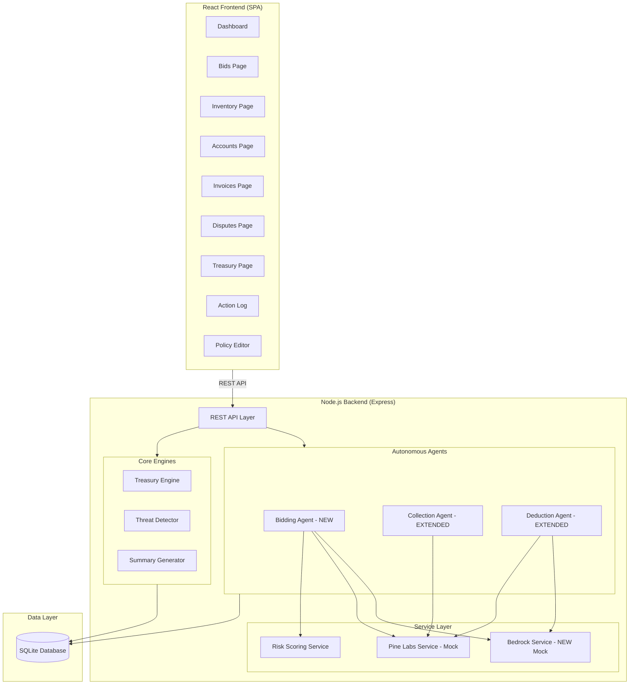
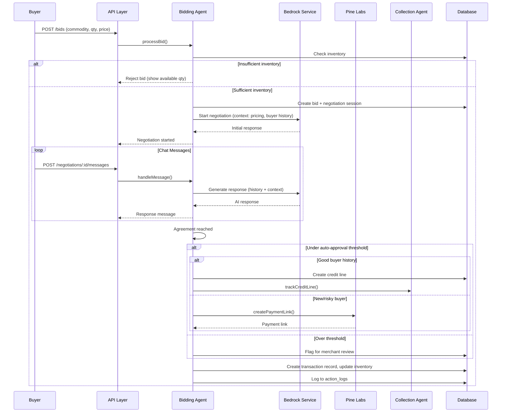
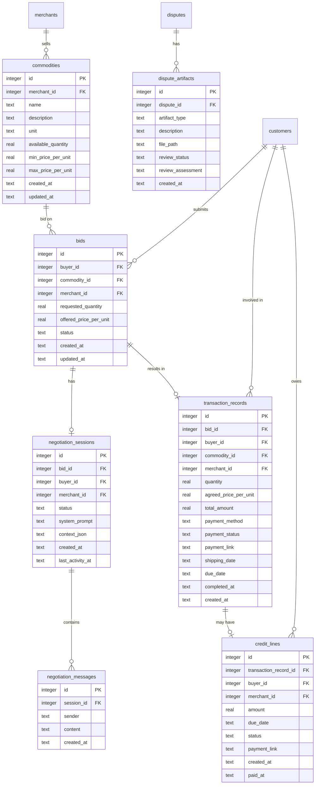

# Design Document: Bidding Agent & Merchant Lifecycle Enhancements

## Overview

This design extends the existing Iris platform (Express.js + React + SQLite) with a new Bidding Agent, Buyer Account Page, Bedrock-powered agentic chat, and lifecycle refinements to the Collection and Deduction agents. The architecture follows the same patterns established in the existing codebase: Knex.js models, Express route handlers, agent classes, and a service abstraction layer.

Key additions:
- **Bidding Agent** (`server/src/agents/biddingAgent.js`): New autonomous agent handling bid intake, inventory checks, negotiation orchestration, and transaction approval
- **Bedrock Service** (`server/src/services/bedrockService.js`): Mock-first AI service for negotiation chat and artifact review, same pattern as Pine Labs mock
- **New DB tables**: commodities, bids, negotiation_sessions, negotiation_messages, transaction_records, credit_lines, dispute_artifacts
- **New routes**: `/api/v1/bids`, `/api/v1/commodities`, `/api/v1/negotiations`, `/api/v1/accounts`
- **New frontend pages**: Bids, Inventory, Accounts (buyer detail)
- **Updated frontend**: Layout renamed to "Iris: Merchant Lifecycle Management", navigation expanded

The existing Treasury, threat detection, and dashboard summary systems remain unchanged. The Collection Agent gets a new `trackCreditLine()` method. The Deduction Agent gets artifact review via Bedrock.

## Architecture

### Extended Architecture Diagram



### Bidding Flow Sequence



### New Directory Structure (additions only)

```
server/src/
├── agents/
│   ├── biddingAgent.js          # NEW
│   ├── collectionAgent.js       # MODIFIED (add trackCreditLine)
│   └── deductionAgent.js        # MODIFIED (add artifact review)
├── models/
│   ├── commodity.js             # NEW
│   ├── bid.js                   # NEW
│   ├── negotiation.js           # NEW
│   ├── transactionRecord.js     # NEW
│   ├── creditLine.js            # NEW
│   └── account.js               # NEW (buyer account aggregation)
├── routes/
│   ├── bids.js                  # NEW
│   ├── commodities.js           # NEW
│   ├── negotiations.js          # NEW
│   └── accounts.js              # NEW
├── services/
│   └── bedrockService.js        # NEW
└── migrations/
    └── 20240102000000_bidding_agent.js  # NEW

client/src/
├── pages/
│   ├── Bids.jsx                 # NEW
│   ├── Inventory.jsx            # NEW
│   └── Accounts.jsx             # NEW
└── components/
    ├── Layout.jsx               # MODIFIED (rename + new nav items)
    └── NegotiationChat.jsx      # NEW
```

## Components and Interfaces

### 1. Bidding Agent (`server/src/agents/biddingAgent.js`)

```javascript
class BiddingAgent {
  async processBid(bidData)
    // Validates bid, checks inventory, creates bid record
    // If inventory sufficient → initiates negotiation
    // If insufficient → rejects with available qty
    // Logs to action_log
    // Requirements: 2.1, 2.2, 2.3, 2.4, 1.4

  async handleNegotiationMessage(sessionId, buyerMessage)
    // Sends buyer message + context to Bedrock
    // Returns AI response (counter-offer or acceptance)
    // Checks if agreement reached → finalizes
    // Requirements: 3.2, 3.3, 3.4

  async finalizeTransaction(sessionId, agreedPrice, paymentMethod)
    // Creates transaction record
    // Decrements inventory
    // If under threshold: auto-approve + payment link or credit line
    // If over threshold: flag for merchant review
    // Logs decision to action_log
    // Requirements: 4.1, 4.2, 4.3, 4.4, 4.5, 4.6, 4.7, 1.3

  async getBuyerHistory(buyerId)
    // Returns transaction count, total value, avg payment time,
    // on-time %, active credit lines, confidence score
    // Requirements: 9.2, 9.3

  async checkCreditEligibility(buyerId)
    // Checks buyer history for credit line eligibility
    // New buyers → no credit
    // Requirements: 9.3, 9.4

  async expireStaleNegotiations()
    // Marks sessions with no activity for 24h as expired
    // Updates bid status to expired
    // Requirements: 3.6
}
```

### 2. Bedrock Service — Mock (`server/src/services/bedrockService.js`)

```javascript
// Same pattern as Pine Labs mock — single file swap for real Bedrock
class BedrockService {
  async chat(systemPrompt, conversationHistory, context)
    // Mock: returns structured response based on input patterns
    // For negotiation: counter-offers, acceptances based on price range
    // For artifact review: structured assessment
    // Requirements: 8.1, 8.4

  async reviewArtifacts(disputeDetails, artifactDescriptions, policyRules)
    // Mock: returns { validity, supportLevel, recommendedResolution }
    // supportLevel: 'strong' | 'moderate' | 'weak'
    // Requirements: 8.3

  // Retry with exponential backoff (3 attempts), same as Pine Labs
  // Requirements: 8.6
}
```

**Mock behavior for negotiation:**
- If offered price ≥ min price: accept immediately
- If offered price < min price but within 20%: counter-offer at midpoint
- If offered price < 80% of min price: reject with explanation
- Responses include natural language wrapped around the decision

**Mock behavior for artifact review:**
- If claim_details length > 50 chars and artifacts present: strong support → full refund
- If claim_details length > 20 chars: moderate support → partial refund
- Otherwise: weak support → rejection

### 3. Extended Collection Agent (additions to existing)

```javascript
// New methods added to collectionAgent.js
async trackCreditLine(creditLineId)
  // Creates collection tracking for credit line
  // Schedules reminder 7 days before due date
  // Requirements: 6.1, 6.2

async handleCreditLinePayment(creditLineId, paymentData)
  // Records payment, updates credit line status
  // Updates buyer confidence score
  // Requirements: 6.5

async escalateCreditLineReminders()
  // Applies existing friendly→firm→final pattern to credit lines
  // Requirements: 6.3, 6.4
```

### 4. Extended Deduction Agent (additions to existing)

```javascript
// New methods added to deductionAgent.js
async reviewArtifacts(disputeId)
  // Fetches dispute artifacts
  // Sends to Bedrock for AI review
  // Applies recommendation if aligned with policy rules
  // Logs assessment to action_log
  // Requirements: 7.1, 7.2, 7.3, 7.4, 7.6

async manualResolution(disputeId, resolution, merchantNotes)
  // Merchant override of artifact review
  // Requirements: 7.5
```

### 5. New API Routes

#### Commodity Routes (`/api/v1/commodities`)
| Method | Path | Description | Requirements |
|--------|------|-------------|-------------|
| GET | `/` | List commodities with stock levels | 1.5 |
| GET | `/:id` | Get commodity detail | 1.1 |
| POST | `/` | Create commodity | 1.1, 1.2 |
| PUT | `/:id` | Update commodity | 1.2 |

#### Bid Routes (`/api/v1/bids`)
| Method | Path | Description | Requirements |
|--------|------|-------------|-------------|
| GET | `/` | List bids with status filters | 2.5, 10.3 |
| GET | `/:id` | Get bid detail with negotiation | 2.1 |
| POST | `/` | Submit new bid | 2.1, 2.2 |
| PATCH | `/:id/approve` | Merchant manual approval | 4.5 |

#### Negotiation Routes (`/api/v1/negotiations`)
| Method | Path | Description | Requirements |
|--------|------|-------------|-------------|
| GET | `/:id` | Get negotiation session with messages | 3.5 |
| POST | `/:id/messages` | Send message in negotiation | 3.2 |

#### Account Routes (`/api/v1/accounts`)
| Method | Path | Description | Requirements |
|--------|------|-------------|-------------|
| GET | `/` | List buyer accounts with status | 5.1, 10.5 |
| GET | `/:buyerId` | Get detailed buyer account page | 5.1, 5.2 |
| GET | `/:buyerId/transactions` | Get buyer transaction history | 5.2, 9.1 |

### 6. Buyer Account Aggregation (`server/src/models/account.js`)

```javascript
// Aggregation queries for the Account Page
async getBuyerAccountSummary(buyerId)
  // Returns: net_transactions, net_payment_due, account_status, confidence_score
  // Requirements: 5.1

async getBuyerTransactionHistory(buyerId)
  // Returns rows with: description, status, course_of_action,
  // amount_recovered, shipping_dates, past_due_date
  // Requirements: 5.2

async computeAccountStatus(buyerId)
  // At Risk (red): overdue > 30 days or confidence < 30
  // Need Reminders (yellow): overdue 1-30 days or confidence 30-60
  // On Time (green): no overdue, confidence > 60
  // Requirements: 5.4

async computeConfidenceScore(buyerId)
  // Based on: on-time payment rate, transaction volume,
  // dispute frequency, credit line repayment history
  // Requirements: 5.7

async determineCourseOfAction(transactionRecord)
  // None: paid/fulfilled
  // Weekly Reminder: 1-14 days overdue
  // Daily Reminder: 15-30 days overdue
  // Human Escalation: 30+ days overdue or dispute raised
  // Requirements: 5.5
```

## Data Models

### New Database Tables (Migration: `20240102000000_bidding_agent.js`)



### Key Data Constraints

| Table | Field | Constraint |
|-------|-------|-----------|
| commodities | available_quantity | Must be >= 0 |
| commodities | min_price_per_unit | Must be > 0 |
| commodities | max_price_per_unit | Must be >= min_price_per_unit |
| bids | status | ENUM: 'submitted', 'negotiating', 'approved', 'rejected', 'expired' |
| bids | requested_quantity | Must be > 0 |
| bids | offered_price_per_unit | Must be > 0 |
| negotiation_sessions | status | ENUM: 'active', 'completed', 'expired' |
| negotiation_messages | sender | ENUM: 'buyer', 'agent' |
| transaction_records | payment_method | ENUM: 'payment_link', 'credit_line' |
| transaction_records | payment_status | ENUM: 'pending', 'paid', 'partial', 'overdue' |
| credit_lines | status | ENUM: 'active', 'paid', 'overdue', 'defaulted' |
| dispute_artifacts | artifact_type | ENUM: 'photo', 'document', 'receipt', 'other' |
| dispute_artifacts | review_status | ENUM: 'pending', 'reviewed', 'manual_override' |

### Account Status Derivation

| Account Status | Color | Condition |
|---------------|-------|-----------|
| At Risk | Red | Any credit line overdue > 30 days OR confidence_score < 30 |
| Need Reminders | Yellow | Any credit line overdue 1-30 days OR confidence_score 30-60 |
| On Time | Green | No overdue credit lines AND confidence_score > 60 |

### Course of Action Derivation

| Course of Action | Condition |
|-----------------|-----------|
| None | Transaction fulfilled and paid |
| Weekly Reminder | 1-14 days past due date |
| Daily Reminder | 15-30 days past due date |
| Human Escalation | 30+ days past due date OR dispute raised |

### Confidence Score Formula

- Base score: 50
- On-time payment bonus: +3 per on-time payment (capped at +25)
- Late payment penalty: -5 per late payment (capped at -30)
- Transaction volume bonus: +1 per completed transaction (capped at +10)
- Dispute penalty: -8 per dispute raised (capped at -20)
- Credit line repayment bonus: +5 per credit line paid on time (capped at +15)
- Final score clamped to [0, 100]

### Seed Data Additions

The existing seed script will be extended to add:
- 10 commodities per merchant (cloth types: cotton, silk, linen, polyester, etc.)
- 30 bids across various statuses
- 15 completed transaction records
- 5 active credit lines
- Sample negotiation sessions with message history
- Dispute artifacts for existing disputes


## Correctness Properties

*A property is a characteristic or behavior that should hold true across all valid executions of a system — essentially, a formal statement about what the system should do. Properties serve as the bridge between human-readable specifications and machine-verifiable correctness guarantees.*

### Property 1: Commodity round-trip persistence

*For any* valid commodity data (name, description, unit, available_quantity, min_price_per_unit, max_price_per_unit), creating a commodity and reading it back should return an equivalent record with all original fields preserved.

**Validates: Requirements 1.1**

### Property 2: Commodity validation rejects invalid pricing and quantity

*For any* commodity where min_price_per_unit > max_price_per_unit, creation should be rejected. *For any* commodity where available_quantity < 0, creation should be rejected. *For any* commodity where min_price_per_unit <= max_price_per_unit and available_quantity >= 0, creation should succeed.

**Validates: Requirements 1.2**

### Property 3: Inventory consistency on bid processing

*For any* commodity with available_quantity Q and any bid with requested_quantity T: if T <= Q, the bid should be accepted and the commodity's available_quantity should become Q - T after transaction approval. If T > Q, the bid should be rejected and the commodity's available_quantity should remain Q.

**Validates: Requirements 1.3, 1.4**

### Property 4: Bid creation round-trip with valid status

*For any* valid bid data (buyer_id, commodity_id, requested_quantity, offered_price_per_unit), creating a bid and reading it back should return an equivalent record, and the status should be one of: 'submitted', 'negotiating', 'approved', 'rejected', 'expired'.

**Validates: Requirements 2.1, 2.5**

### Property 5: Negotiation session created with bid context for sufficient inventory

*For any* bid where the requested quantity is within available inventory, a negotiation session should be created with status 'active' and context_json containing the commodity details, offered price, and merchant price range.

**Validates: Requirements 2.3, 3.1**

### Property 6: Bid processing logged to action log

*For any* bid submission, an action log entry should exist with agent_type 'bidding', non-null inputs containing bid details, and non-empty reasoning.

**Validates: Requirements 2.4**

### Property 7: Negotiation message round-trip

*For any* message sent in an active negotiation session (by buyer or agent), the message should be stored and retrievable with correct sender, content, and a valid timestamp. For any buyer message, an agent response message should also be stored.

**Validates: Requirements 3.2, 3.5**

### Property 8: Negotiation finalization creates transaction record

*For any* completed negotiation session where agreement is reached, a transaction_record should exist with the agreed price, quantity, buyer reference, commodity reference, and a valid payment method.

**Validates: Requirements 3.4**

### Property 9: Stale negotiation expiry

*For any* negotiation session with last_activity_at more than 24 hours in the past and status 'active', running the expiry check should set the session status to 'expired' and the associated bid status to 'expired'.

**Validates: Requirements 3.6**

### Property 10: Auto-approval threshold determines approval path

*For any* negotiated transaction: if total_amount < Auto_Approval_Threshold, the transaction should be auto-approved (bid status = 'approved'). If total_amount >= Auto_Approval_Threshold, the transaction should be flagged for merchant review (not auto-approved).

**Validates: Requirements 4.1, 4.5**

### Property 11: Credit line eligibility based on buyer history

*For any* buyer with zero prior transactions, the payment method should be restricted to 'payment_link' (no credit line offered). *For any* buyer with strong payment history (on-time rate > 80%, confidence_score > 60) and transaction below threshold, a credit line option should be available.

**Validates: Requirements 4.2, 9.4**

### Property 12: Credit line record creation on credit transactions

*For any* transaction approved with payment_method 'credit_line', a credit_lines record should exist with the correct amount, a due_date, status 'active', and a link to the transaction_record.

**Validates: Requirements 4.4, 6.1**

### Property 13: Approved transactions recorded in treasury

*For any* approved transaction, a treasury transaction record with type 'incoming' and the correct amount should exist in the transactions table.

**Validates: Requirements 4.6**

### Property 14: Approval decisions logged with full context

*For any* transaction approval decision, an action log entry should exist with agent_type 'bidding', decision_type containing 'approve' or 'flag', and inputs containing transaction amount, payment method, and buyer history summary.

**Validates: Requirements 4.7**

### Property 15: Account summary contains required fields

*For any* buyer with at least one transaction, the account summary API should return: net_transactions (number), net_payment_due (number >= 0), account_status (one of 'at_risk', 'need_reminders', 'on_time'), and confidence_score (number in [0, 100]).

**Validates: Requirements 5.1**

### Property 16: Transaction history contains required columns

*For any* buyer with transactions, the transaction history API should return rows where each row contains: description (non-empty string), status (one of 'fulfilled', 'pending_full_payment', 'pending_partial_payment', 'dispute_raised'), course_of_action (one of 'none', 'weekly_reminder', 'daily_reminder', 'human_escalation'), amount_recovered (number >= 0), and past_due_days (integer >= 0).

**Validates: Requirements 5.2, 5.3, 5.5, 5.6**

### Property 17: Confidence score range and computation

*For any* valid buyer history inputs (on-time payments, late payments, transaction count, dispute count, credit line repayments), the computed confidence score should be in [0, 100] and should increase with on-time payments and decrease with late payments and disputes.

**Validates: Requirements 5.7, 9.3**

### Property 18: Account status change logging

*For any* buyer whose account status changes (e.g., from 'on_time' to 'need_reminders'), an action log entry should exist recording the previous status, new status, and contributing factors.

**Validates: Requirements 5.8**

### Property 19: Credit line reminders contain payment link and transaction details

*For any* credit line reminder sent by the Collection Agent, the reminder should contain a non-null Pine Labs payment_link and the inputs should reference the original transaction details.

**Validates: Requirements 6.2, 6.4**

### Property 20: Credit line escalation follows state machine

*For any* overdue credit line, the reminder escalation should follow the sequence friendly → firm → final with no skipped levels, consistent with the existing Collection Agent escalation pattern.

**Validates: Requirements 6.3**

### Property 21: Confidence score updated after credit line payment events

*For any* credit line payment event (paid on time, paid late, or missed), the buyer's confidence score should be recalculated. On-time payment should not decrease the score, and missed payment should not increase the score.

**Validates: Requirements 6.5**

### Property 22: Artifact review produces structured assessment

*For any* dispute with uploaded artifacts, initiating an artifact review should produce a response containing: artifact validity (boolean), support level ('strong', 'moderate', or 'weak'), and a recommended resolution.

**Validates: Requirements 7.1, 7.2**

### Property 23: Artifact review resolution aligned with policy

*For any* artifact review recommendation, if the recommended resolution aligns with active policy rules (e.g., refund amount within threshold), the resolution should be applied. If it conflicts, the resolution should not be auto-applied.

**Validates: Requirements 7.3**

### Property 24: Valid deduction triggers Pine Labs refund

*For any* dispute where artifact review confirms a valid deduction (support level 'strong' and policy-aligned), a Pine Labs refund should be processed and a transaction record with type 'outgoing' should exist.

**Validates: Requirements 7.4**

### Property 25: Artifact review logged to action log

*For any* artifact review, an action log entry should exist with agent_type 'deduction', decision_type 'artifact_review', and inputs containing the assessment, recommendation, and final decision.

**Validates: Requirements 7.6**

### Property 26: Bedrock service returns response for valid inputs

*For any* valid input (non-empty system prompt, conversation history array, context object), the Bedrock service chat method should return a non-empty string response.

**Validates: Requirements 8.1**

### Property 27: Bedrock service retry on failure

*For any* Bedrock service call that fails, the system should retry up to 3 times with exponential backoff. After 3 failures, the error should be logged in the action log.

**Validates: Requirements 8.6**

### Property 28: Transaction record round-trip persistence

*For any* valid transaction record data (buyer_id, commodity_id, quantity, agreed_price_per_unit, payment_method, shipping_date), creating a record and reading it back should return an equivalent record with all fields preserved.

**Validates: Requirements 9.1**

### Property 29: Buyer history returns complete metrics

*For any* buyer with at least one completed transaction, the getBuyerHistory function should return: total_transaction_count (> 0), total_transaction_value (> 0), average_payment_time (>= 0), on_time_payment_percentage (0-100), and active_credit_lines (>= 0).

**Validates: Requirements 9.2**

## Error Handling

### New Error Categories

| Category | HTTP Status | Handling |
|----------|------------|---------|
| Insufficient inventory | 409 | Return available quantity, reject bid |
| Negotiation session expired | 410 | Return expiry reason, bid marked expired |
| Bedrock service failure | 502 | Retry 3x with exponential backoff, log to Action_Log |
| Invalid commodity pricing (min > max) | 400 | Return validation error with field details |
| Credit line not eligible | 403 | Return reason (new buyer, low confidence) |
| Bid not found | 404 | Return bid ID |
| Negotiation session not active | 409 | Return current session status |

### Bedrock Service Retry Strategy

Same pattern as Pine Labs:
```
Attempt 1: Immediate
Attempt 2: Wait 1 second
Attempt 3: Wait 4 seconds
After 3 failures: Log to Action_Log, return error to caller
```

### Agent Error Handling

- **Bidding Agent**: If Bedrock fails during negotiation, return a fallback message to the buyer ("I'm having trouble processing your request, please try again shortly") and log the failure. Do not expire the session due to a transient error.
- **Collection Agent (credit lines)**: If reminder sending fails for a credit line, log the failure and retry on next evaluation cycle. Same pattern as existing invoice reminders.
- **Deduction Agent (artifact review)**: If Bedrock fails during artifact review, mark the review as 'pending' and notify the merchant for manual review. Do not auto-resolve.

## Testing Strategy

### Testing Framework

Same as existing: Vitest + fast-check + supertest.

### Property-Based Testing Configuration

- Library: fast-check
- Minimum 100 iterations per property test
- Each test tagged with: `Feature: bidding-agent, Property {N}: {title}`
- Each correctness property (1–29) maps to one property-based test

### New Test Files

```
server/tests/
├── unit/
│   ├── agents/
│   │   └── biddingAgent.test.js
│   ├── models/
│   │   ├── commodity.test.js
│   │   ├── bid.test.js
│   │   └── account.test.js
│   └── services/
│       └── bedrockService.test.js
├── property/
│   ├── commodity.property.test.js
│   ├── bid.property.test.js
│   ├── negotiation.property.test.js
│   ├── transaction.property.test.js
│   ├── account.property.test.js
│   ├── creditLine.property.test.js
│   ├── artifactReview.property.test.js
│   └── bedrockService.property.test.js
└── integration/
    ├── bids.integration.test.js
    ├── commodities.integration.test.js
    ├── negotiations.integration.test.js
    └── accounts.integration.test.js
```

### Key Test Generators (fast-check arbitraries)

```javascript
// Commodity generator
const commodityArb = fc.record({
  name: fc.stringOf(fc.char(), { minLength: 1, maxLength: 50 }),
  description: fc.string({ minLength: 1, maxLength: 200 }),
  unit: fc.constantFrom('meters', 'rolls', 'pieces', 'kg', 'yards'),
  available_quantity: fc.float({ min: 0, max: 10000, noNaN: true }),
  min_price_per_unit: fc.float({ min: 1, max: 50000, noNaN: true }),
}).chain(c => fc.record({
  ...Object.fromEntries(Object.entries(c).map(([k, v]) => [k, fc.constant(v)])),
  max_price_per_unit: fc.float({ min: c.min_price_per_unit, max: 100000, noNaN: true }),
}));

// Bid generator
const bidArb = fc.record({
  buyer_id: fc.integer({ min: 1, max: 50 }),
  commodity_id: fc.integer({ min: 1, max: 50 }),
  requested_quantity: fc.float({ min: 0.1, max: 5000, noNaN: true }),
  offered_price_per_unit: fc.float({ min: 1, max: 100000, noNaN: true }),
});

// Buyer history generator
const buyerHistoryArb = fc.record({
  onTimePayments: fc.integer({ min: 0, max: 50 }),
  latePayments: fc.integer({ min: 0, max: 20 }),
  transactionCount: fc.integer({ min: 0, max: 100 }),
  disputeCount: fc.integer({ min: 0, max: 10 }),
  creditLineRepayments: fc.integer({ min: 0, max: 20 }),
});
```

### Dual Testing Approach

**Unit Tests** (specific examples and edge cases):
- Commodity CRUD with specific data
- Bid submission with exact inventory scenarios
- Negotiation message handling with known inputs
- Credit line creation with specific buyer profiles
- Account status computation with boundary values
- Bedrock mock response patterns
- Confidence score with known inputs/outputs

**Property-Based Tests** (universal properties via fast-check):
- Each correctness property (1–29) maps to one property-based test
- Each test generates random valid inputs and verifies the property holds
- Minimum 100 iterations per test
- Each test tagged with: `Feature: bidding-agent, Property {N}: {title}`
