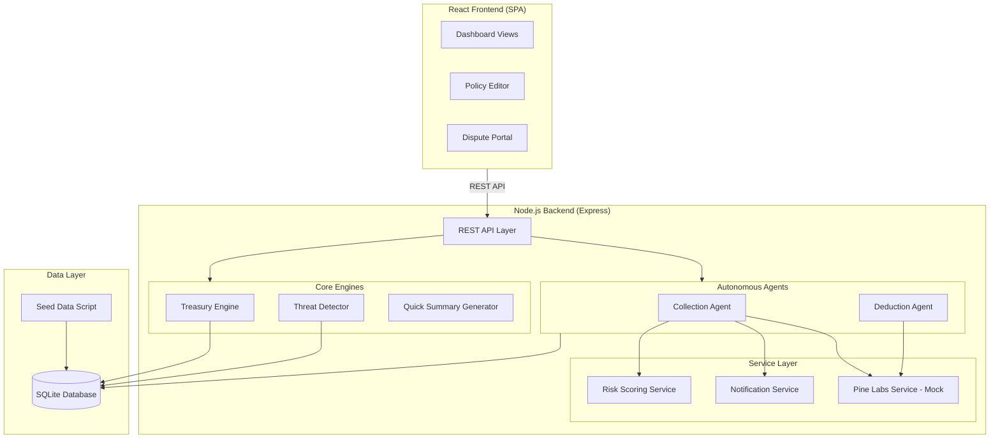
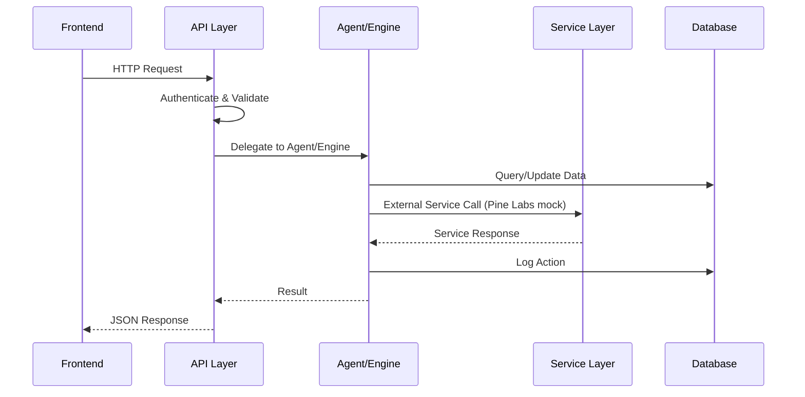
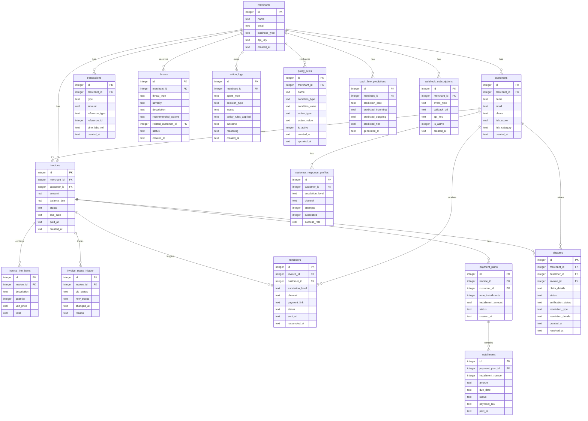

# Design Document: Project Iris

## Overview

Project Iris is an AI-powered autonomous finance recovery and cash flow management platform for small businesses. The system is built as a standalone web portal (React + Node.js) with SQLite for prototype simplicity, a mocked Pine Labs payment gateway, and a plugin-ready REST API architecture.

The platform operates through four pillars:
- **Collection**: Automated invoice tracking, reminder escalation, payment plans, and risk scoring
- **Deduction**: Dispute intake, verification, and autonomous resolution
- **Treasury**: Money movement tracking, cash flow prediction, and threat detection
- **Overall Cash Flow**: Unified dashboard, quick summaries, action logs, and policy management

The hackathon prototype uses seed data (5 merchants, 50 customers, 200 invoices, 30 disputes, 500 transactions) and a mock Pine Labs service layer designed for trivial swap to real integration.

## Architecture

### High-Level Architecture



### Request Flow



### Directory Structure

```
project-iris/
├── client/                    # React frontend
│   ├── src/
│   │   ├── components/        # Reusable UI components
│   │   ├── pages/             # Page-level views
│   │   │   ├── Dashboard.jsx
│   │   │   ├── Invoices.jsx
│   │   │   ├── Disputes.jsx
│   │   │   ├── Treasury.jsx
│   │   │   ├── ActionLog.jsx
│   │   │   ├── PolicyEditor.jsx
│   │   │   └── CustomerRisk.jsx
│   │   ├── services/          # API client functions
│   │   ├── hooks/             # Custom React hooks
│   │   └── App.jsx
│   └── package.json
├── server/                    # Node.js backend
│   ├── src/
│   │   ├── routes/            # Express route handlers
│   │   ├── agents/            # Collection Agent, Deduction Agent
│   │   ├── engines/           # Treasury Engine, Threat Detector, Summary Generator
│   │   ├── services/          # Pine Labs mock, Notification, Risk Scoring
│   │   ├── models/            # Database access layer (Knex/better-sqlite3)
│   │   ├── middleware/        # Auth, validation, error handling
│   │   ├── seed/              # Seed data generation
│   │   └── app.js
│   └── package.json
├── shared/                    # Shared types/constants
└── package.json               # Root workspace
```

### Technology Choices

| Layer | Technology | Rationale |
|-------|-----------|-----------|
| Frontend | React + Vite | Fast dev, component-based, hackathon-friendly |
| UI Library | Recharts + Tailwind CSS | Charts for dashboards, utility-first styling |
| Backend | Express.js (Node.js) | Lightweight, fast to prototype REST APIs |
| Database | SQLite (via better-sqlite3) | Zero-config, file-based, no external DB needed |
| Query Builder | Knex.js | SQL builder with migration support, DB-agnostic (trivial swap to PostgreSQL/MySQL for AWS RDS) |
| Testing | Vitest + fast-check | Fast test runner + property-based testing library |
| API Auth | API key middleware | Simple auth for plugin-ready architecture |

### AWS Deployment Readiness

The architecture is designed for easy migration from local development to AWS:

**Prototype (Local):**
- SQLite file stored at `./data/iris.db` — no external database needed
- All services run in a single Node.js process
- Frontend served as static files or via Vite dev server

**AWS Migration Path (minimal changes):**
- **Database**: Swap SQLite → AWS RDS (PostgreSQL) by changing Knex.js config only. All queries use Knex query builder, not raw SQLite-specific SQL. The migration is a config file change:
  ```javascript
  // Local (prototype)
  { client: 'better-sqlite3', connection: { filename: './data/iris.db' } }
  // AWS (production)
  { client: 'pg', connection: { host: process.env.DB_HOST, ... } }
  ```
- **Backend**: Deploy as Docker container on ECS Fargate, or as Lambda functions behind API Gateway. Express.js works with both.
- **Frontend**: Deploy to S3 + CloudFront as static site.
- **Pine Labs Service**: Swap mock file with real SDK integration — same abstraction layer.
- **Environment Config**: All config via environment variables (DB connection, API keys, Pine Labs credentials). No hardcoded values.

**Design Constraints for AWS Readiness:**
- No SQLite-specific SQL syntax — all queries via Knex.js abstractions
- No local filesystem dependencies except the SQLite DB file (which gets replaced by RDS)
- Stateless backend — no in-memory session state, all state in database
- Environment variables for all configuration
- CORS configured for separate frontend/backend deployment


## Components and Interfaces

### 1. REST API Layer (`server/src/routes/`)

All endpoints follow the pattern `/api/v1/{resource}` with JSON request/response bodies. API key authentication via `X-API-Key` header.

#### Invoice Routes (`/api/v1/invoices`)
| Method | Path | Description | Requirements |
|--------|------|-------------|-------------|
| GET | `/` | List invoices with status/date filters | 1.4 |
| GET | `/:id` | Get invoice detail with history | 1.6 |
| POST | `/` | Create new invoice | 1.1 |
| PATCH | `/:id/pay` | Record full payment | 1.2 |
| PATCH | `/:id/partial-pay` | Record partial payment | 1.5 |

#### Reminder Routes (`/api/v1/reminders`)
| Method | Path | Description | Requirements |
|--------|------|-------------|-------------|
| GET | `/` | List reminders with filters | 2.5 |
| POST | `/trigger` | Trigger reminder evaluation for overdue invoices | 2.1, 2.2, 2.3 |

#### Payment Plan Routes (`/api/v1/payment-plans`)
| Method | Path | Description | Requirements |
|--------|------|-------------|-------------|
| GET | `/` | List payment plans | 4.4 |
| POST | `/` | Create payment plan for customer | 4.1, 4.2 |
| PATCH | `/:id/installments/:installmentId/pay` | Record installment payment | 4.3 |

#### Dispute Routes (`/api/v1/disputes`)
| Method | Path | Description | Requirements |
|--------|------|-------------|-------------|
| GET | `/` | List disputes with filters | 6.1 |
| GET | `/:id` | Get dispute detail | 6.2 |
| POST | `/` | Create new dispute (customer-facing) | 6.1 |
| POST | `/:id/resolve` | Trigger autonomous resolution | 7.1, 7.2, 7.6 |
| POST | `/:id/re-evaluate` | Re-evaluate with new info | 7.4 |

#### Treasury Routes (`/api/v1/treasury`)
| Method | Path | Description | Requirements |
|--------|------|-------------|-------------|
| GET | `/cash-flow` | Get cash flow summary for time period | 11.1, 11.2 |
| GET | `/transactions` | List transactions timeline | 8.4 |
| GET | `/predictions` | Get cash flow predictions (90 days) | 9.1, 9.4 |
| GET | `/net-balance` | Get running net balance | 8.3 |

#### Threat Routes (`/api/v1/threats`)
| Method | Path | Description | Requirements |
|--------|------|-------------|-------------|
| GET | `/` | List active threats with severity | 10.5 |
| POST | `/evaluate` | Trigger threat evaluation | 10.1–10.4 |

#### Customer Routes (`/api/v1/customers`)
| Method | Path | Description | Requirements |
|--------|------|-------------|-------------|
| GET | `/` | List customers with risk scores | 12.1 |
| GET | `/:id` | Get customer detail with risk profile | 5.4, 12.2 |
| GET | `/:id/risk-history` | Get risk score change history | 12.2 |

#### Dashboard Routes (`/api/v1/dashboard`)
| Method | Path | Description | Requirements |
|--------|------|-------------|-------------|
| GET | `/summary` | Get quick summary | 14.1, 14.2 |
| GET | `/metrics` | Get key metric cards | 11.4 |
| GET | `/action-log` | Get action log entries | 13.1, 13.2 |

#### Policy Routes (`/api/v1/policies`)
| Method | Path | Description | Requirements |
|--------|------|-------------|-------------|
| GET | `/` | List policy rules | 15.1 |
| POST | `/` | Create policy rule | 15.2 |
| PUT | `/:id` | Update policy rule | 15.3 |
| DELETE | `/:id` | Delete policy rule | 15.1 |
| GET | `/templates` | Get rule templates | 15.4 |

#### Webhook Routes (`/api/v1/webhooks`)
| Method | Path | Description | Requirements |
|--------|------|-------------|-------------|
| POST | `/subscribe` | Subscribe to events | 18.3 |
| DELETE | `/:id` | Unsubscribe | 18.3 |
| POST | `/pine-labs/callback` | Pine Labs payment callback | 16.4 |

### 2. Collection Agent (`server/src/agents/collectionAgent.js`)

```javascript
// Core interface
class CollectionAgent {
  async evaluateOverdueInvoices()        // Marks overdue, triggers reminders (Req 1.3, 2.1)
  async sendReminder(invoiceId, level)   // Sends reminder at escalation level (Req 2.1–2.4)
  async escalateReminders()              // Checks and escalates pending reminders (Req 2.2, 2.3)
  async selectReminderStrategy(customerId) // Picks best channel/tone (Req 3.1, 3.2)
  async offerPaymentPlan(invoiceId)      // Offers EMI based on policy (Req 4.1, 4.4)
  async flagHighRiskAccounts()           // Flags accounts exceeding thresholds (Req 5.1, 5.2)
  async computeRiskScore(customerId)     // Calculates risk score (Req 5.4)
}
```

### 3. Deduction Agent (`server/src/agents/deductionAgent.js`)

```javascript
class DeductionAgent {
  async createDispute(disputeData)       // Creates dispute record (Req 6.1)
  async verifyClaim(disputeId)           // Cross-references order data (Req 6.2, 6.3)
  async resolveDispute(disputeId)        // Autonomous resolution per policy (Req 7.1, 7.6)
  async processRefund(disputeId, amount) // Processes refund via Pine Labs (Req 7.2)
  async reEvaluate(disputeId, newInfo)   // Re-evaluates with new info (Req 7.4)
}
```

### 4. Treasury Engine (`server/src/engines/treasuryEngine.js`)

```javascript
class TreasuryEngine {
  async recordTransaction(txData)        // Records incoming/outgoing (Req 8.1, 8.2)
  async getNetBalance()                  // Computes running net balance (Req 8.3)
  async getCashFlowTimeline(period)      // Returns transaction timeline (Req 8.4)
  async generatePredictions()            // Generates 90-day forecast (Req 9.1, 9.3)
  async checkCashFlowRisk()              // Checks for negative balance risk (Req 9.2)
  async getCashFlowSummary(startDate, endDate) // Summary for period (Req 11.1)
}
```

### 5. Threat Detector (`server/src/engines/threatDetector.js`)

```javascript
class ThreatDetector {
  async evaluateThreats()                // Runs all threat checks (Req 10.1–10.4)
  async checkRefundRatio(merchantId)     // Refund-to-collection ratio (Req 10.1)
  async checkSlowCollections(merchantId) // Average days-to-pay trend (Req 10.2)
  async checkCustomerFraud(customerId)   // Refund spike detection (Req 10.3)
  async checkPaymentAnomalies()          // Unusual patterns (Req 10.4)
  async suggestReminderTiming(customerId) // Optimal send time (Req 10.6)
}
```

### 6. Pine Labs Service — Mock (`server/src/services/pinelabsService.js`)

```javascript
// Abstract interface — mock implementation for hackathon
class PineLabsService {
  async createPaymentLink(invoiceId, amount, expiry)  // Returns mock URL (Req 16.1)
  async sendPaymentLinkViaSMS(phone, link)             // Mock SMS delivery (Req 16.3)
  async sendPaymentLinkViaEmail(email, link)           // Mock email delivery (Req 16.3)
  async processRefund(transactionRef, amount)           // Mock refund (Req 16.5)
  async validateCallback(payload)                       // Validates callback data (Req 16.7)
}

// Mock implementation returns:
// Payment links: https://pinelabs.mock/pay/{invoiceId}?amount={amount}
// Refund refs: MOCK-REFUND-{timestamp}
// All calls succeed with 200ms simulated delay
```

**Design Decision**: The Pine Labs service is behind an interface. The mock implementation is a single file (`pinelabsService.js`). Swapping to real Pine Labs requires only replacing this file and updating config with real API keys. No business logic changes needed. This satisfies Requirement 16.8.

### 7. Risk Scoring Service (`server/src/services/riskScoringService.js`)

```javascript
class RiskScoringService {
  computeRiskScore(paymentHistory, overdueFrequency, avgDaysToPay) // Returns 0-100 score (Req 5.4)
  categorizeRisk(score)  // Returns 'low' | 'medium' | 'high' (Req 12.1)
}
```

Risk score formula:
- Base score: 50
- Late payment frequency penalty: +5 per late payment (capped at +30)
- Average days-to-pay penalty: +(avgDays - 30) * 0.5 if > 30 days
- Overdue amount penalty: +10 per overdue invoice currently active
- Good payment bonus: -5 per on-time payment (capped at -30)
- Final score clamped to [0, 100]

Categories: 0–33 = low, 34–66 = medium, 67–100 = high

### 8. Quick Summary Generator (`server/src/engines/summaryGenerator.js`)

```javascript
class SummaryGenerator {
  async generateSummary(merchantId)  // Returns <200 word plain language summary (Req 14.1–14.4)
}
```

Generates summary from: collection rate trend, refund trend, top 3 risk customers, active threats, and 2-3 recommended actions. Template-based generation for the prototype.


## Data Models

### Database Schema (SQLite via Knex.js)



### Key Data Constraints

| Table | Field | Constraint |
|-------|-------|-----------|
| invoices | status | ENUM: 'pending', 'overdue', 'paid', 'partial' |
| invoices | balance_due | Must be >= 0 and <= amount |
| reminders | escalation_level | ENUM: 'friendly', 'firm', 'final' |
| reminders | channel | ENUM: 'email', 'sms', 'whatsapp' |
| disputes | status | ENUM: 'open', 'verifying', 'resolved', 'reopened' |
| disputes | resolution_type | ENUM: 'full_refund', 'partial_refund', 'replacement', 'rejection', null |
| transactions | type | ENUM: 'incoming', 'outgoing' |
| threats | severity | ENUM: 'low', 'medium', 'high', 'critical' |
| threats | status | ENUM: 'active', 'acknowledged', 'resolved' |
| policy_rules | condition_type | ENUM: 'refund_threshold', 'emi_eligibility', 'reminder_timing', 'risk_threshold' |
| risk_score | value | Clamped to [0, 100] |
| risk_category | value | Derived: 0–33 = 'low', 34–66 = 'medium', 67–100 = 'high' |
| installments | status | ENUM: 'pending', 'paid', 'missed' |
| payment_plans | status | ENUM: 'active', 'completed', 'defaulted' |

### Seed Data Strategy

The seed script (`server/src/seed/seedDatabase.js`) generates:
- 5 merchants with distinct business types (D2C brand, service business, freelancer, manufacturer, retailer)
- 10 customers per merchant (50 total) with varied risk profiles
- ~40 invoices per merchant (200 total): 40% paid, 30% pending, 20% overdue, 10% partial
- 6 disputes per merchant (30 total): mix of open, resolved, reopened
- 100 transactions per merchant (500 total): payments and refunds over 6 months
- Pre-computed risk scores, response profiles, and action log entries
- 2-3 active threats per merchant
- Default policy rules per merchant

All amounts in INR (₹500–₹5,00,000 range). Indian business names and realistic date distributions.


## Correctness Properties

*A property is a characteristic or behavior that should hold true across all valid executions of a system — essentially, a formal statement about what the system should do. Properties serve as the bridge between human-readable specifications and machine-verifiable correctness guarantees.*

### Property 1: Invoice creation round-trip

*For any* valid invoice data (amount, due date, customer reference, line items), creating an invoice and then reading it back should return an equivalent record with all original fields preserved.

**Validates: Requirements 1.1**

### Property 2: Invoice payment status transition

*For any* pending or overdue invoice that receives a full payment, the invoice status should transition to 'paid' and the balance_due should become 0.

**Validates: Requirements 1.2**

### Property 3: Overdue detection

*For any* pending invoice whose due date is strictly in the past, running the overdue evaluation should mark the invoice as 'overdue'.

**Validates: Requirements 1.3**

### Property 4: Invoice grouping exhaustiveness

*For any* set of invoices, grouping by status should be exhaustive — every invoice appears in exactly one group (pending, overdue, paid, or partial) and the sum of group sizes equals the total invoice count.

**Validates: Requirements 1.4**

### Property 5: Partial payment balance invariant

*For any* invoice with balance B and any partial payment amount P where 0 < P < B, after recording the partial payment the new balance should equal B - P and the status should remain 'pending' (or 'partial').

**Validates: Requirements 1.5**

### Property 6: Invoice history completeness

*For any* invoice that undergoes N status transitions, the invoice_status_history table should contain exactly N records for that invoice, each with correct old_status, new_status, and timestamp.

**Validates: Requirements 1.6**

### Property 7: Reminder escalation state machine

*For any* overdue invoice, the reminder escalation should follow the sequence: friendly → firm → final. A friendly reminder with no response after 7 days should produce a firm reminder, and a firm reminder with no response after 7 days should produce a final notice. No escalation should skip a level.

**Validates: Requirements 2.1, 2.2, 2.3**

### Property 8: Reminders always contain payment links

*For any* reminder created by the Collection Agent, the payment_link field should be non-null, non-empty, and contain a valid Pine Labs URL with the correct invoice reference and amount.

**Validates: Requirements 2.4, 16.2**

### Property 9: Customer response profile update

*For any* payment that follows a reminder, the customer's response profile should be updated to reflect the successful escalation level and channel, and the success_rate should be recalculated correctly.

**Validates: Requirements 3.1, 3.3**

### Property 10: Adaptive reminder strategy selection

*For any* customer with historical response profile data, the Collection Agent should select the reminder channel and escalation level with the highest success_rate from that customer's profile.

**Validates: Requirements 3.2**

### Property 11: Payment plan installment sum invariant

*For any* payment plan created for an invoice with balance_due B and N installments, the sum of all installment amounts should equal B (within rounding tolerance of ₹1).

**Validates: Requirements 4.4**

### Property 12: Payment plan installment links

*For any* accepted payment plan with N installments, exactly N Pine Labs payment links should be generated, one per installment.

**Validates: Requirements 4.2**

### Property 13: EMI offer threshold

*For any* overdue invoice and a policy rule specifying "offer EMI if overdue > N days", the Collection Agent should offer a payment plan if and only if the invoice has been overdue for more than N days.

**Validates: Requirements 4.1**

### Property 14: High-risk flagging threshold

*For any* customer whose total overdue invoice amount exceeds the merchant-configured threshold, the customer should be flagged as high-risk. Customers below the threshold should not be flagged.

**Validates: Requirements 5.1**

### Property 15: Risk score monotonicity with late payments

*For any* customer, adding a late payment to their history should result in a risk score that is greater than or equal to the previous score (monotonically non-decreasing with respect to late payment count).

**Validates: Requirements 5.2**

### Property 16: Risk score range and categorization

*For any* valid inputs (payment history, overdue frequency, average days-to-pay), the computed risk score should be in [0, 100], and the category should be: 0–33 = 'low', 34–66 = 'medium', 67–100 = 'high'.

**Validates: Requirements 5.4, 12.1**

### Property 17: Collection priority ordering

*For any* set of customers with different risk scores, the Collection Agent's prioritized contact list should be sorted by risk score in descending order (highest risk first).

**Validates: Requirements 12.3**

### Property 18: Dispute creation round-trip

*For any* valid dispute data (customer, invoice, claim details), creating a dispute and reading it back should return an equivalent record.

**Validates: Requirements 6.1**

### Property 19: Incomplete dispute requests missing info

*For any* dispute where required verification data is missing (e.g., no order reference, no delivery proof), the Deduction Agent should set verification_status to 'needs_info' and not proceed to resolution.

**Validates: Requirements 6.3**

### Property 20: Auto-approve refund threshold

*For any* verified dispute with amount ≤ the policy threshold X, the Deduction Agent should auto-approve the refund. For any dispute with amount > X, the Deduction Agent should not auto-approve.

**Validates: Requirements 7.6**

### Property 21: Refund transaction recording

*For any* dispute resolved as full or partial refund, a Pine Labs refund should be processed and a transaction record with type='outgoing' should exist in the database.

**Validates: Requirements 7.2**

### Property 22: Action log completeness

*For any* autonomous decision made by the Collection Agent or Deduction Agent, an action log entry should exist with non-null decision_type, inputs, policy_rules_applied, outcome, and a non-empty human-readable reasoning summary.

**Validates: Requirements 13.1, 13.3**

### Property 23: Action log chronological ordering

*For any* set of action log entries returned by the API, they should be sorted by created_at in descending order (most recent first).

**Validates: Requirements 13.2**

### Property 24: Transaction recording for all Pine Labs events

*For any* payment or refund processed via Pine Labs Gateway, a corresponding transaction record should exist with the correct type ('incoming' for payments, 'outgoing' for refunds) and amount.

**Validates: Requirements 8.1, 8.2**

### Property 25: Net cash flow balance invariant

*For any* set of transactions, the net cash flow balance should equal the sum of all incoming amounts minus the sum of all outgoing amounts.

**Validates: Requirements 8.3**

### Property 26: Cash flow summary period filtering

*For any* time period [start, end] and set of transactions, the cash flow summary should include only transactions within that period, and total_collections - total_refunds should equal the net balance.

**Validates: Requirements 11.1, 11.2**

### Property 27: Dashboard metrics consistency

*For any* set of invoices and transactions, the metrics should satisfy: collection_rate = total_collected / (total_collected + total_receivables), and net_position = total_collected - total_refunded.

**Validates: Requirements 11.4**

### Property 28: Cash flow prediction negative balance alert

*For any* set of cash flow predictions where the predicted net balance goes negative within 30 days, a cash flow risk alert should be generated.

**Validates: Requirements 9.2**

### Property 29: High refund ratio threat detection

*For any* merchant where the ratio of refunds to collections in a rolling 30-day window exceeds the configured threshold, a "high refund ratio" threat alert should be generated.

**Validates: Requirements 10.1**

### Property 30: Slow collections threat detection

*For any* merchant where the average days-to-pay across all customers exceeds the configured threshold, a "slow collections" threat alert should be generated.

**Validates: Requirements 10.2**

### Property 31: Customer fraud spike detection

*For any* customer whose refund request count in a rolling period exceeds a threshold, a "potential fraud" threat alert should be generated.

**Validates: Requirements 10.3**

### Property 32: Threat alert completeness

*For any* threat alert, the record should contain non-null severity (low/medium/high/critical), description, and recommended_actions fields.

**Validates: Requirements 10.5**

### Property 33: Quick summary word count invariant

*For any* generated Quick Summary, the word count should be under 200 words.

**Validates: Requirements 14.4**

### Property 34: Quick summary required sections

*For any* generated Quick Summary, the text should reference collection performance, refund trends, top risk customers, active threats, and recommended actions.

**Validates: Requirements 14.2**

### Property 35: Policy rule validation

*For any* policy rule missing a condition or action, creation should be rejected. For any policy rule that conflicts with an existing active rule of the same condition_type, creation should be rejected.

**Validates: Requirements 15.2**

### Property 36: Policy rule CRUD round-trip

*For any* valid policy rule, creating it and reading it back should return an equivalent record. Updating a field and reading back should reflect the update.

**Validates: Requirements 15.1**

### Property 37: Payment link format validity

*For any* invoice, the generated Pine Labs payment link should match the pattern `https://pinelabs.mock/pay/{invoiceId}?amount={amount}` with the correct invoice ID and amount.

**Validates: Requirements 16.1**

### Property 38: Payment callback invoice update

*For any* valid payment callback payload, the corresponding invoice should be updated to 'paid' status and a transaction record should be created.

**Validates: Requirements 16.4**

### Property 39: Malformed response rejection

*For any* malformed or unauthorized Pine Labs API response, the system should reject it and not update any invoice or transaction state.

**Validates: Requirements 16.7**

### Property 40: API response consistency

*For any* API endpoint response, the JSON should follow a consistent envelope format with `success`, `data`, and optional `error` fields.

**Validates: Requirements 18.1**

### Property 41: API key authentication enforcement

*For any* API request without a valid API key, the system should return HTTP 401. For any request with a valid API key, the system should proceed to process the request.

**Validates: Requirements 18.4**

### Property 42: Seed data amounts in INR range

*For any* seeded invoice or transaction, the amount should be in the range ₹500–₹5,00,000 and dates should span the last 6 months.

**Validates: Requirements 17.2**


## Error Handling

### API Error Response Format

All errors follow a consistent JSON envelope:

```json
{
  "success": false,
  "error": {
    "code": "INVOICE_NOT_FOUND",
    "message": "Invoice with ID 123 not found",
    "details": {}
  }
}
```

### Error Categories

| Category | HTTP Status | Handling |
|----------|------------|---------|
| Validation errors (missing fields, invalid types) | 400 | Return specific field errors |
| Authentication failure (missing/invalid API key) | 401 | Return auth error, log attempt |
| Resource not found | 404 | Return resource type and ID |
| Policy conflict (conflicting rules) | 409 | Return conflicting rule details |
| Pine Labs service failure | 502 | Retry with exponential backoff (3 attempts), log to Action_Log |
| Internal server error | 500 | Log full error, return generic message |

### Pine Labs Retry Strategy

```
Attempt 1: Immediate
Attempt 2: Wait 1 second
Attempt 3: Wait 4 seconds
After 3 failures: Log to Action_Log, return error to caller
```

### Agent Error Handling

- **Collection Agent**: If reminder sending fails, log the failure and retry on next evaluation cycle. Never skip an escalation level due to a transient error.
- **Deduction Agent**: If refund processing fails, keep dispute in 'resolved' status but mark refund as 'pending_retry'. Retry on next cycle.
- **Treasury Engine**: If prediction generation fails, serve the most recent valid prediction set. Log the failure.
- **Threat Detector**: If a threat check fails, log the error and continue with remaining checks. Never suppress a valid threat due to a partial failure.

### Database Error Handling

- All write operations use transactions. If any step fails, the entire operation rolls back.
- Seed script is idempotent — running it twice does not duplicate data (uses INSERT OR IGNORE / upsert patterns).

## Testing Strategy

### Testing Framework

- **Test Runner**: Vitest (fast, Vite-native, ESM support)
- **Property-Based Testing**: fast-check (JavaScript PBT library, integrates with Vitest)
- **HTTP Testing**: supertest (for API endpoint testing)
- **Minimum PBT iterations**: 100 per property test

### Dual Testing Approach

**Unit Tests** (specific examples and edge cases):
- Invoice CRUD operations with specific data
- Reminder escalation with exact date scenarios
- Risk score computation with known inputs/outputs
- Policy rule validation with specific valid/invalid rules
- Payment link format with specific invoice data
- Seed data count verification (Req 17.1, 17.3)
- API template endpoints (Req 15.4)
- Pine Labs retry behavior with controlled failure counts (Req 16.6)

**Property-Based Tests** (universal properties via fast-check):
- Each correctness property (1–42) maps to one property-based test
- Each test generates random valid inputs and verifies the property holds
- Minimum 100 iterations per test
- Each test tagged with: `Feature: project-iris, Property {N}: {title}`

### Test Organization

```
server/
├── tests/
│   ├── unit/
│   │   ├── agents/
│   │   │   ├── collectionAgent.test.js
│   │   │   └── deductionAgent.test.js
│   │   ├── engines/
│   │   │   ├── treasuryEngine.test.js
│   │   │   ├── threatDetector.test.js
│   │   │   └── summaryGenerator.test.js
│   │   ├── services/
│   │   │   ├── pinelabsService.test.js
│   │   │   └── riskScoringService.test.js
│   │   └── models/
│   │       └── invoice.test.js
│   ├── property/
│   │   ├── invoice.property.test.js
│   │   ├── reminder.property.test.js
│   │   ├── riskScore.property.test.js
│   │   ├── dispute.property.test.js
│   │   ├── treasury.property.test.js
│   │   ├── threat.property.test.js
│   │   ├── policy.property.test.js
│   │   ├── summary.property.test.js
│   │   ├── pinelabs.property.test.js
│   │   └── api.property.test.js
│   └── integration/
│       └── api.integration.test.js
```

### Key Test Generators (fast-check arbitraries)

```javascript
// Invoice generator
const invoiceArb = fc.record({
  amount: fc.float({ min: 500, max: 500000, noNaN: true }),
  due_date: fc.date({ min: sixMonthsAgo, max: threeMonthsFromNow }),
  customer_id: fc.integer({ min: 1, max: 50 }),
  merchant_id: fc.integer({ min: 1, max: 5 }),
  line_items: fc.array(lineItemArb, { minLength: 1, maxLength: 5 })
});

// Risk score inputs generator
const riskInputsArb = fc.record({
  latePaymentCount: fc.integer({ min: 0, max: 20 }),
  onTimePaymentCount: fc.integer({ min: 0, max: 50 }),
  overdueInvoiceCount: fc.integer({ min: 0, max: 10 }),
  avgDaysToPay: fc.float({ min: 0, max: 120, noNaN: true })
});

// Policy rule generator
const policyRuleArb = fc.record({
  condition_type: fc.constantFrom('refund_threshold', 'emi_eligibility', 'reminder_timing', 'risk_threshold'),
  condition_value: fc.json(),
  action_type: fc.constantFrom('auto_approve', 'offer_emi', 'send_reminder', 'flag_risk'),
  action_value: fc.json()
});
```

### Coverage Goals

- All 42 correctness properties covered by property-based tests
- Unit tests for edge cases: zero amounts, boundary dates, empty collections, max values
- Integration tests for critical API flows: invoice lifecycle, dispute resolution, payment callback
